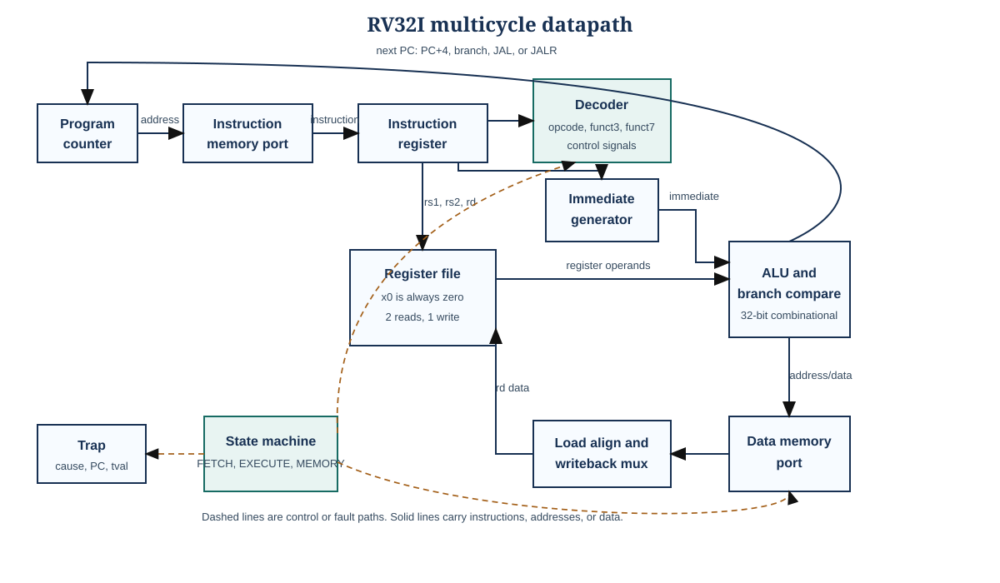
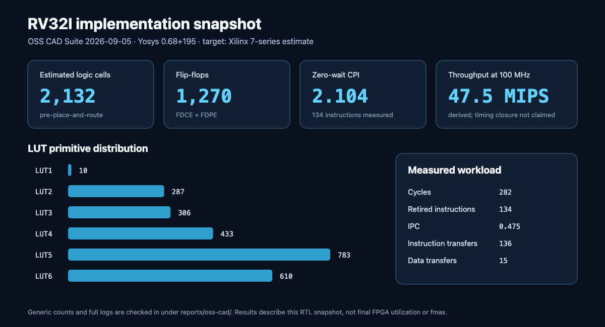
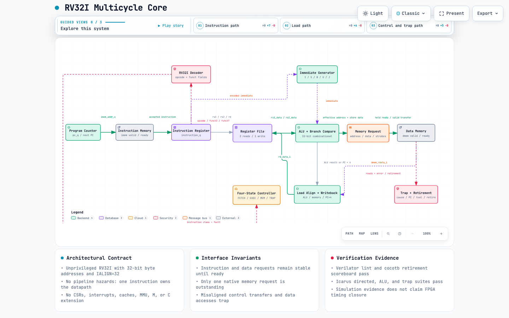

# RV32I SystemVerilog CPU core

This repository contains a small, synthesizable 32-bit RISC-V processor written for learning, simulation, and FPGA work. It implements the full unprivileged RV32I base instruction set with separate instruction and data memory ports.

The design uses a multicycle controller. An ordinary ALU instruction takes a fetch cycle and an execute cycle, plus however long memory takes to answer. Loads and stores add a memory state. This is slower than a pipeline, but it is much easier to inspect in a waveform and works naturally with synchronous FPGA memory.



The current measured implementation snapshot is below. These are reproducible
core-only synthesis and simulation results, not post-route FPGA claims.

[](docs/synthesis_and_performance.md)

For a deeper design review, open the
[interactive Archify architecture map](docs/archify/rv32i-core.architecture.html).
It adds guided instruction, load, and control/trap views; relationship tracing;
light and dark themes; and source-grounded interface and verification notes.

[](docs/archify/rv32i-core.architecture.html)

## What is implemented

- All RV32I integer, branch, jump, load, store, `FENCE`, `ECALL`, and `EBREAK` instructions
- 32 general-purpose registers with x0 hardwired to zero
- Little-endian byte, halfword, and word memory access
- Signed and unsigned loads and comparisons
- Ready/valid instruction and data interfaces with wait-state support
- Traps for illegal instructions, alignment errors, access faults, `ECALL`, and `EBREAK`
- A small memory and GPIO wrapper for simulation or FPGA use
- An Arty A7-100T top module, constraints, LED program, and Vivado batch scripts
- Directed tests, trap tests, assertions, a Python encoder, and an independent RV32I reference model

This is an unprivileged core. It does not contain machine-mode CSRs, interrupts, caches, an MMU, multiplication, division, or compressed instructions. The trap outputs let a surrounding system see why execution stopped, but there is no hardware trap handler or `MRET` instruction.

## Repository map

| Path | Purpose |
| --- | --- |
| `rtl/rv32i_core.sv` | Multicycle controller and main datapath |
| `rtl/rv32i_decoder.sv` | Legal instruction recognition and control signals |
| `rtl/rv32i_alu.sv` | Arithmetic, logic, shifts, and set-less-than operations |
| `rtl/rv32i_regfile.sv` | 32 by 32-bit register file |
| `rtl/rv32i_imm_gen.sv` | I, S, B, U, and J immediate reconstruction |
| `rtl/rv32i_soc.sv` | Synchronous memory wrapper and memory-mapped GPIO |
| `tb/` | Self-checking SystemVerilog tests and assertions |
| `python/` | Machine-code encoder and independent instruction model |
| `sim/programs/` | Generated test and FPGA demo images |
| `fpga/` | Arty A7 top module and pin constraints |
| `scripts/` | PowerShell and Vivado batch commands |
| `reports/oss-cad/` | Machine-readable synthesis metrics and complete Yosys logs |
| `docs/` | Architecture, interactive/static diagrams, instruction notes, and lab guides |

## Verification quick start

The test images are generated from readable Python instruction calls, so no RISC-V compiler is required.

Create the development environment once:

```bash
python3 -m venv .venv
.venv/bin/python -m pip install -r requirements-dev.txt
```

Run the complete local gate (Icarus tests, Verilator/cocotb tests, and the
independent Python model):

```bash
make test PYTHON=.venv/bin/python
make lint-verilator
```

Generate the measured OSS CAD Suite synthesis and performance report:

```bash
make oss-cad-report PYTHON=.venv/bin/python
```

The target expects the installed suite at
`../oss-cad-suite-build-main/oss-cad-suite`; override `OSS_CAD_ROOT` if it is
elsewhere. The flow uses the suite's Slang frontend for the SystemVerilog
package/import syntax, then runs generic Yosys synthesis and a Xilinx 7-series
technology estimate.

Generate a compact FST waveform and open the curated CPU signal groups:

```bash
make test-cocotb-waves PYTHON=.venv/bin/python
./scripts/open_wave.sh
```

The cocotb regression drives deterministic zero-to-three-cycle instruction and
data-memory waits. It checks request stability, compares every retired PC and
instruction against the independent Python ISA model, and verifies an illegal
instruction's sticky trap record. Verilator writes
`sim/build/cocotb/dump.fst`; `waves/rv32i_core.gtkw` groups the state,
retirement, bus, and trap signals for GTKWave.

On Windows PowerShell with Icarus Verilog installed, the original directed HDL
tests remain available:

```powershell
python sim/build_programs.py
.\scripts\run_tests.ps1
```

With Vivado on `PATH`, run any one of the three self-checking testbenches:

```powershell
python sim/build_programs.py
vivado -mode batch -source scripts/vivado_sim.tcl -tclargs tb_alu
vivado -mode batch -source scripts/vivado_sim.tcl -tclargs tb_core_directed
vivado -mode batch -source scripts/vivado_sim.tcl -tclargs tb_core_traps
```

The directed program writes `0x600d600d` to address `0x00000900` when every check passes. It writes `0xbad00001` if a comparison fails. The SystemVerilog testbench watches that signature and stops automatically.

## Vivado and the Arty A7-100T

Generate the FPGA demo image, then run the batch build from the repository root:

```powershell
python sim/build_programs.py
vivado -mode batch -source scripts/vivado_build.tcl
```

The finished bitstream is written under `build/vivado/rv32i_arty_a7.runs/impl_1/`. LED 0 blinks under software control. LED 1 reports a trap, LED 2 follows a program-counter bit, and LED 3 is a clock heartbeat.

The GUI procedure, expected files, and common setup mistakes are in [docs/vivado_quickstart.md](docs/vivado_quickstart.md).

## Reading order

Start with the [architecture guide](output/pdf/architecture.pdf), then explore the [interactive Archify map](docs/archify/rv32i-core.architecture.html) or use the [learning guide](output/pdf/learning_guide.pdf) to follow one `LW` instruction through the core. [docs/instruction_notes.md](docs/instruction_notes.md) is the compact instruction reference. The exact memory handshake is described in [docs/memory_interface.md](docs/memory_interface.md).

The sources that informed the design are listed in [docs/references.md](docs/references.md). The RTL and diagram specification are original work. PicoRV32 and Ibex informed memory-interface and documentation choices; Aegis-Stream informed the concise invariant-focused RTL comment structure and layered simulation workflow; Archify renders and validates the interactive architecture artifact.

## Measured implementation snapshot

On 2026-09-05, the 134-instruction directed workload completed in 282 measured
cycles with zero-wait instruction and data ports: **2.104 CPI / 0.475 IPC**.
At a hypothetical 100 MHz clock that rate is 47.5 MIPS, but 100 MHz is only a
conversion point until place-and-route timing closes. With the regression's
seeded 0–3-cycle memory delays, the same workload completed in 501 cycles:
**3.739 CPI / 0.267 IPC**, including 200 instruction-port and 20 data-port wait
cycles.

OSS CAD Suite 2026-09-05 (Yosys 0.68+195 and the Slang frontend) synthesized
`rv32i_core` successfully. The generic result contains 8,307 cells, including
1,269 sequential cells and 1,149 mux cells. Mapping to Xilinx 7-series
primitives estimates **2,132 logic cells**, **1,270 flip-flops**, 2,429 LUT
primitives, and 52 `CARRY4` cells. This intentionally excludes the SoC memory
wrapper and is a pre-place-and-route estimate; Vivado remains the authority for
Arty A7 utilization, BRAM inference, timing, and maximum clock frequency.

See [the full synthesis and performance report](docs/synthesis_and_performance.md)
and the checked-in [machine-readable summary](reports/oss-cad/summary.json).

## Current verification record

On 2026-09-05, Verilator 5.048 elaborated the RTL and cocotb 2.0.1 passed all
three CPU tests: the reference-model comparison with wait states, the zero-wait
performance measurement, and the sticky illegal-instruction trap check. The
directed tests matched 134 retirements against the Python model while exercising
both memory ports. The existing Icarus suites passed all 10 ALU checks, the full
directed program, and all 9 trap checks. The Python model reached the pass
signature after 134 retired instructions. The included GitHub Actions job
repeats the non-GUI checks on every push and pull request.

Vivado was not installed in the development shell used for this pass, so the checked-in xsim and bitstream scripts still need to be run on a Vivado installation before an FPGA result is claimed. See [docs/debug_log.md](docs/debug_log.md) for the exact record.

## License

The project is released under the BSD 2-Clause license. See [LICENSE](LICENSE).
