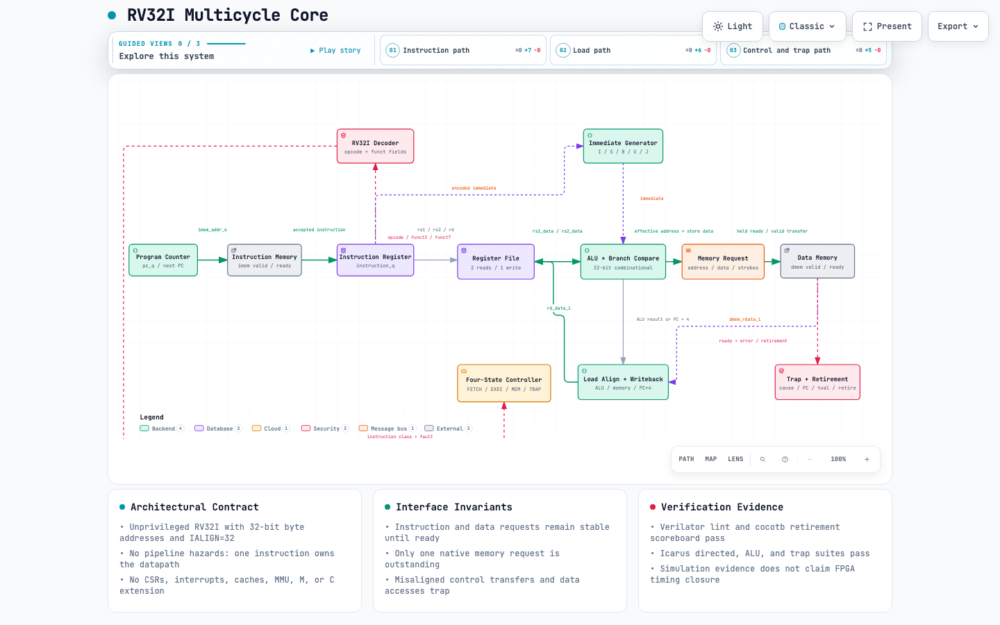

# RV32I SystemVerilog CPU core

This repository contains a small 32-bit RISC-V processor written for learning, simulation, and eventual FPGA work. It implements the unprivileged RV32I base instruction set with separate instruction and data memory ports. The pipeline RTL has passed simulation and elaboration; synthesis on Vivado remains to be checked.

The core now uses five in-order stages: IF, ID, EX, MEM, and WB. Valid bits carry instructions between stages. Register dependencies and memory waits stall younger instructions; branches resolve in EX, and faults drain older work before the trap becomes visible. See [docs/pipeline.md](docs/pipeline.md) for the current stage contract.

The older datapath drawing and generated architecture guides below describe the previous multicycle implementation and need regeneration for this pipeline.

The [earlier OSS CAD synthesis report](docs/synthesis_and_performance.md) and
its raw logs also describe that multicycle design. Current pipeline synthesis
and implementation results are in [the Vivado report](docs/pipeline_vivado_report.md).

For a deeper design review, open the
[interactive Archify architecture map](docs/archify/rv32i-core.architecture.html).
It adds guided instruction, load, and control/trap views; relationship tracing;
light and dark themes; and source-grounded interface and verification notes.

[](docs/archify/rv32i-core.architecture.html)

## What is implemented

- All RV32I integer, branch, jump, load, store, `FENCE`, `ECALL`, and `EBREAK` instructions
- 32 general-purpose registers with x0 hardwired to zero
- Little-endian byte, halfword, and word memory access
- Signed and unsigned loads and comparisons
- Ready/valid instruction and data interfaces with wait-state support
- Traps for illegal instructions, alignment errors, access faults, `ECALL`, and `EBREAK`
- A small memory and GPIO wrapper for simulation or FPGA use
- An Arty A7-100T top module, constraints, LED program, and Vivado batch scripts
- Directed tests, trap tests, assertions, a Python encoder, and an independent RV32I reference model

This is an unprivileged core. It does not contain machine-mode CSRs, interrupts, caches, an MMU, multiplication, division, or compressed instructions. The trap outputs let a surrounding system see why execution stopped, but there is no hardware trap handler or `MRET` instruction.

## Repository map

| Path | Purpose |
| --- | --- |
| `rtl/rv32i_core.sv` | Five-stage pipeline and main datapath |
| `rtl/rv32i_decoder.sv` | Legal instruction recognition and control signals |
| `rtl/rv32i_alu.sv` | Arithmetic, logic, shifts, and set-less-than operations |
| `rtl/rv32i_regfile.sv` | 32 by 32-bit register file |
| `rtl/rv32i_imm_gen.sv` | I, S, B, U, and J immediate reconstruction |
| `rtl/rv32i_soc.sv` | Synchronous memory wrapper and memory-mapped GPIO |
| `tb/` | Self-checking SystemVerilog tests and assertions |
| `python/` | Machine-code encoder and independent instruction model |
| `sim/programs/` | Generated test and FPGA demo images |
| `fpga/` | Arty A7 top module and pin constraints |
| `scripts/` | PowerShell and Vivado batch commands |
| `docs/` | Architecture, interactive/static diagrams, instruction notes, and lab guides |

## Verification quick start

The test images are generated from readable Python instruction calls, so no RISC-V compiler is required.

Create the development environment once:

```bash
python3 -m venv .venv
.venv/bin/python -m pip install -r requirements-dev.txt
```

Run the complete local gate (Icarus tests, Verilator/cocotb tests, and the
independent Python model):

```bash
make test PYTHON=.venv/bin/python
make lint-verilator
```

Generate a compact FST waveform and open the curated CPU signal groups:

```bash
make test-cocotb-waves PYTHON=.venv/bin/python
./scripts/open_wave.sh
```

The cocotb regression drives deterministic zero-to-three-cycle instruction and
data-memory waits. It checks request stability, compares every retired PC and
instruction against the independent Python ISA model, and covers pipeline
overlap, RAW stalls, memory waits, branch redirection, and sticky traps. Verilator writes
`sim/build/cocotb/dump.fst`; `waves/rv32i_core.gtkw` groups the state,
retirement, bus, and trap signals for GTKWave.

On Windows PowerShell with Icarus Verilog installed, the original directed HDL
tests remain available:

```powershell
python sim/build_programs.py
.\scripts\run_tests.ps1
.\.venv\Scripts\python.exe scripts\run_cocotb.py --simulator icarus
```

With Vivado on `PATH`, run any one of the three self-checking testbenches:

```powershell
python sim/build_programs.py
vivado -mode batch -source scripts/vivado_sim.tcl -tclargs tb_alu
vivado -mode batch -source scripts/vivado_sim.tcl -tclargs tb_core_directed
vivado -mode batch -source scripts/vivado_sim.tcl -tclargs tb_core_traps
```

The directed program writes `0x600d600d` to address `0x00000900` when every check passes. It writes `0xbad00001` if a comparison fails. The SystemVerilog testbench watches that signature and stops automatically.

## Vivado and the Arty A7-100T

Generate the FPGA demo image, then run the batch build from the repository root:

```powershell
python sim/build_programs.py
vivado -mode batch -source scripts/vivado_build.tcl
```

The finished bitstream is written under `build/vivado/rv32i_arty_a7.runs/impl_1/`. LED 0 blinks under software control. LED 1 reports a trap, LED 2 follows a program-counter bit, and LED 3 is a clock heartbeat.

The GUI procedure, expected files, and common setup mistakes are in [docs/vivado_quickstart.md](docs/vivado_quickstart.md).

## Reading order

Start with the [architecture guide](output/pdf/architecture.pdf), then explore the [interactive Archify map](docs/archify/rv32i-core.architecture.html) or use the [learning guide](output/pdf/learning_guide.pdf) to follow one `LW` instruction through the core. [docs/instruction_notes.md](docs/instruction_notes.md) is the compact instruction reference. The exact memory handshake is described in [docs/memory_interface.md](docs/memory_interface.md).

The sources that informed the design are listed in [docs/references.md](docs/references.md). The RTL and diagram specification are original work. PicoRV32 and Ibex informed memory-interface and documentation choices; Aegis-Stream informed the concise invariant-focused RTL comment structure and layered simulation workflow; Archify renders and validates the interactive architecture artifact.

## Current verification record

On 2026-09-25, slang elaborated the pipeline with zero errors and warnings. Icarus 14 passed the ALU, directed-program, and nine-trap tests. Cocotb 2.0.1 passed three CPU scenarios with retirement scoreboards and pipeline coverage. Vivado 2023.2 xsim passed the same three SystemVerilog benches. The Arty A7-100T implementation uses four RAMB36 blocks, 1,631 LUTs, and 1,560 registers; routed setup slack is +0.681 ns at the 10 ns clock constraint. The bitstream was generated but has not been tested on a physical board. See [docs/pipeline_vivado_report.md](docs/pipeline_vivado_report.md) for the exact evidence and remaining warnings.
