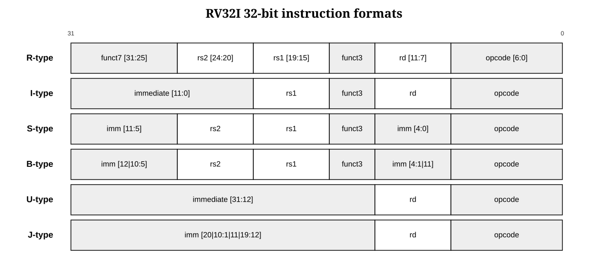

# RV32I instruction notes

RV32I uses six 32-bit instruction layouts. Register fields stay in the same bit positions when they are present. Immediate fields move around, which lets the major opcode and register positions remain regular.

## Instruction coverage

| Group | Instructions | Core behavior |
| --- | --- | --- |
| Upper immediate | `LUI`, `AUIPC` | Build a 32-bit constant or add one to the PC |
| Jumps | `JAL`, `JALR` | Write `PC + 4` to `rd` and change the PC |
| Branches | `BEQ`, `BNE`, `BLT`, `BGE`, `BLTU`, `BGEU` | Compare two registers and conditionally change the PC |
| Loads | `LB`, `LH`, `LW`, `LBU`, `LHU` | Read one aligned word, select bytes, then extend |
| Stores | `SB`, `SH`, `SW` | Replicate store data and select byte lanes with `wstrb` |
| Immediate ALU | `ADDI`, `SLTI`, `SLTIU`, `XORI`, `ORI`, `ANDI`, `SLLI`, `SRLI`, `SRAI` | ALU with a sign-extended immediate or encoded shift amount |
| Register ALU | `ADD`, `SUB`, `SLL`, `SLT`, `SLTU`, `XOR`, `SRL`, `SRA`, `OR`, `AND` | ALU with two register operands |
| Ordering | `FENCE` | Accepted as an ordered no-op because only one memory request can be outstanding |
| Environment | `ECALL`, `EBREAK` | Enter the sticky trap state |

These are the 40 named instructions in the RV32I base. `FENCE.I` is part of the separate Zifencei extension and is illegal in this core. CSR instructions are in Zicsr and are also illegal here.

## Signed operations

RISC-V uses the same stored bits for signed and unsigned integers. The instruction chooses the interpretation.

- `SLT`, `SLTI`, `BLT`, and `BGE` cast both operands to signed two's-complement values.
- `SLTU`, `SLTIU`, `BLTU`, and `BGEU` compare the raw unsigned bit patterns.
- `SRA` and `SRAI` copy the sign bit as they shift right.
- `SRL` and `SRLI` shift zeros into the upper bits.

The immediate for `SLTIU` is sign extended before the unsigned comparison. The final comparison is unsigned, but the immediate formation still follows the I-type rule.

## Alignment policy

This core uses `IALIGN=32` because it does not implement compressed 16-bit instructions.

- Instruction addresses must be multiples of four.
- Halfword data addresses must be multiples of two.
- Word data addresses must be multiples of four.
- Byte accesses may use any address.

Misaligned data is trapped. It is not repaired in hardware. Software that needs an unaligned word must use byte operations or a library routine.

## Useful encodings

| Assembly | Machine word | Meaning |
| --- | --- | --- |
| `addi x0, x0, 0` | `00000013` | Architectural NOP |
| `ecall` | `00000073` | Environment-call trap |
| `ebreak` | `00100073` | Breakpoint trap |
| `fence` with empty masks | `0000000f` | Legal FENCE encoding |

The encoder in `python/rv32i_encode.py` shows each field calculation directly. The generated files use one little-endian 32-bit instruction word per text line because `$readmemh` loads words, not byte streams.
